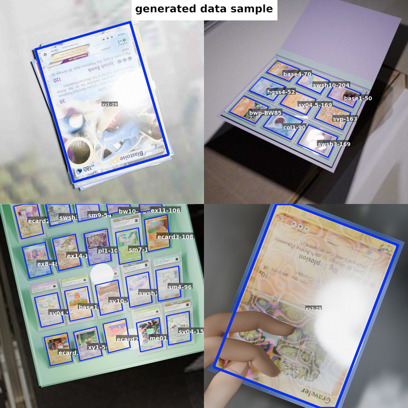

# tcgDataSynth

An experiment in leveraging agentic workflows to create programmatically generated 3d scenes to be rendered into synthetic training data for use in computer vision model training.

"Blender 5.0 synthetic-scene generator for training trading-card detectors. It builds randomized cards, protection, finishes, damage, layouts, and labels while keeping geometry-independent logic testable outside Blender."




## Demo

demo using a yolo segmentation model and mobilenet embedding model both fine tuned entirely on synthetic data


## Blender Setup

The known Blender executable is:

```text
C:\Program Files\Blender Foundation\Blender 5.0\blender.exe
```

Install runtime dependencies into Blender's bundled Python from an administrator terminal:

```bat
"C:\Program Files\Blender Foundation\Blender 5.0\5.0\python\bin\python.exe" -m pip install opencv-python-headless shapely
```

## Standalone GUI

Set paths in `config.json` to the Blender 5.0 executable, then run the
desktop GUI with a normal Python installation:

```bash
python gui.py
```

## For Models

### Current State

See `PROJECT_STATUS.md` for the active checkpoint, validated decisions, and next work. See `LABEL_FORMAT.md` before consuming labels.

### Development Model

The development container has no Blender or GUI. Code is split accordingly:

```text
rules/          deterministic scene sampling and legality
texturegen/     OpenCV/NumPy texture generation
postfx/         deterministic render post-processing
labeltools/     label geometry, serialization, and visualization
blender/        bpy-only scene construction and rendering
tests/unit/     container-runnable tests
tests/t*.py     numbered Blender acceptance scripts
assets/         checked-in generated textures and compact Blender libraries
out/            generated output (ignored)
```

Substantial Blender changes are delivered through a focused numbered script, then paused for user feedback before the next major change.

### Container Setup

Python 3.11 is expected.

```bash
python -m venv .venv
.venv/bin/python -m pip install -r requirements-dev.txt
bash run_unit_tests.sh
.venv/bin/python -m compileall -q .
```

`run_unit_tests.sh` fails early when required dependencies are absent. Shapely is mandatory because silently omitting occlusion would produce incorrect labels.

### Blender info

The image root must contain `back.png`. Optional `picture_regions.json` entries use `{card_id: [x0, y0, x1, y1]}` normalized from the image's top-left.

Set `table_texture_dir` in `config.json` to a directory of background photographs.
Every table-bearing layout chooses either one image or four images in a smoothly blended
2x2 arrangement. Production workers require this setting for table-bearing layouts;
the procedural fallback remains available only to direct layout tests.

The hand layout loads `assets/hand_rig.blend` by default. `TCG_HAND_ASSET` remains an
optional diagnostic override for another compatible library.

The compact hand library passed `tests/t15_hand_asset_bundle.py` under Blender 5.0.0
and the five integrated `tests/t14_hand.py` cases passed from the bundled default.
Rebuild and validation instructions are in `assets/HAND_RIG.md`.

### GUI Info

The GUI persists its count, base seed, texture directory, and option toggles to
`config.json`. This includes the global cardless-scene probability and optional YOLO
segmentation export. It launches
one headless Blender worker per pair, so Pause waits for the active pair to be published
and prevents any later worker from starting. Completed pairs are in `out/images` and
`out/labels`; optional segmentation files are written to `out/labels_yolo` with matching
`<card_id>|<holo_tag>` rows in `out/extra_label`. `out/manifest.jsonl` makes resume
numbering deterministic and gap-safe. `out/card_cache` is removed after every worker.
If a Blender worker fails, the GUI records that seed as skipped in the manifest and
continues with the next seed instead of retrying it.
Rare card instances whose finite-box corner refraction cannot be solved use their direct
pre-refraction polygon for labels/occlusion and are listed in `out/refraction_failures.txt`.


### Label Formats

The custom occlusion-aware polygon remains the primary label. Enable the
`Export YOLO segmentation + extra labels` option for a standard class-0 polygon;
YOLO derives its bounding box from the polygon's min/max envelope. See `LABEL_FORMAT.md`.
